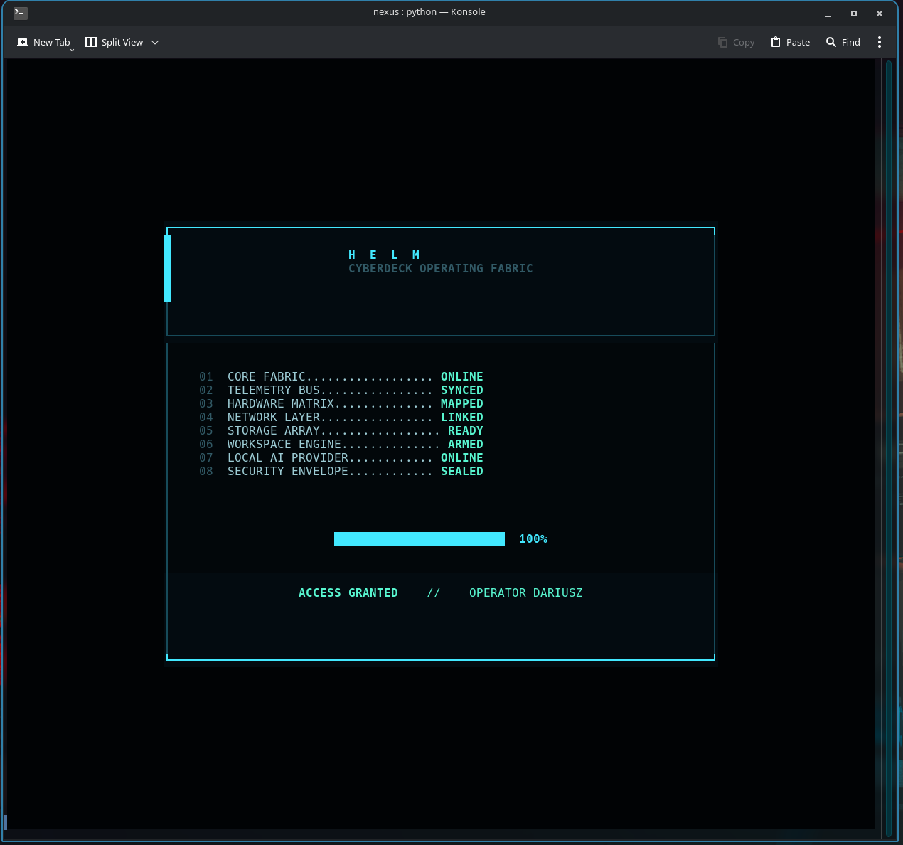
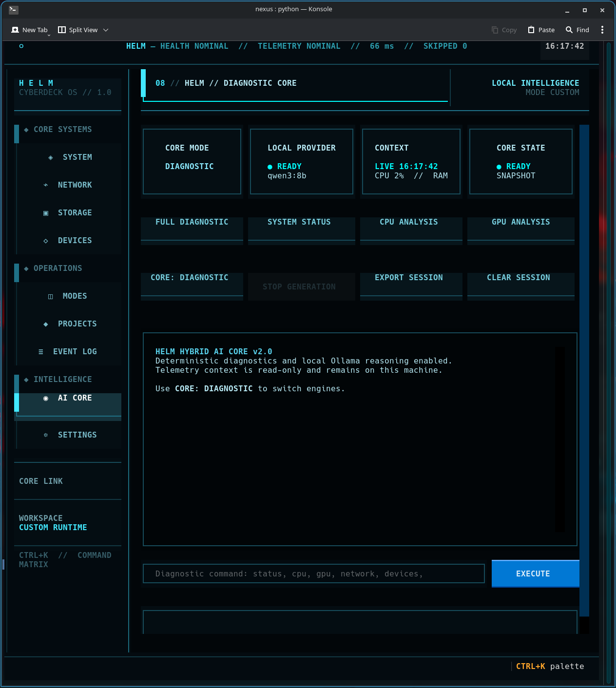
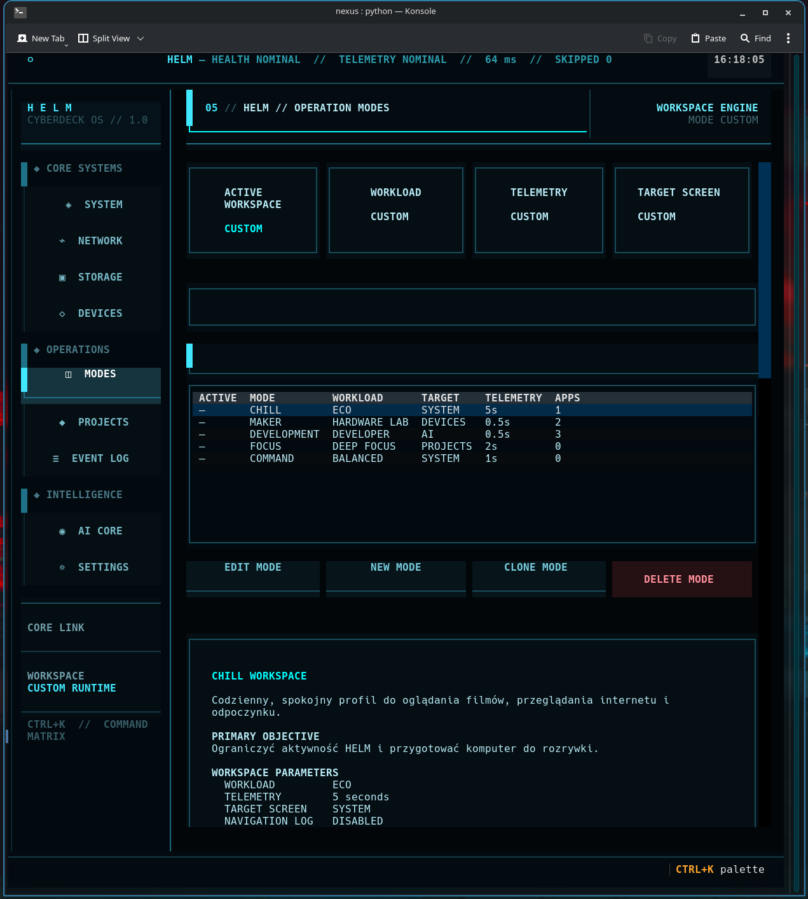
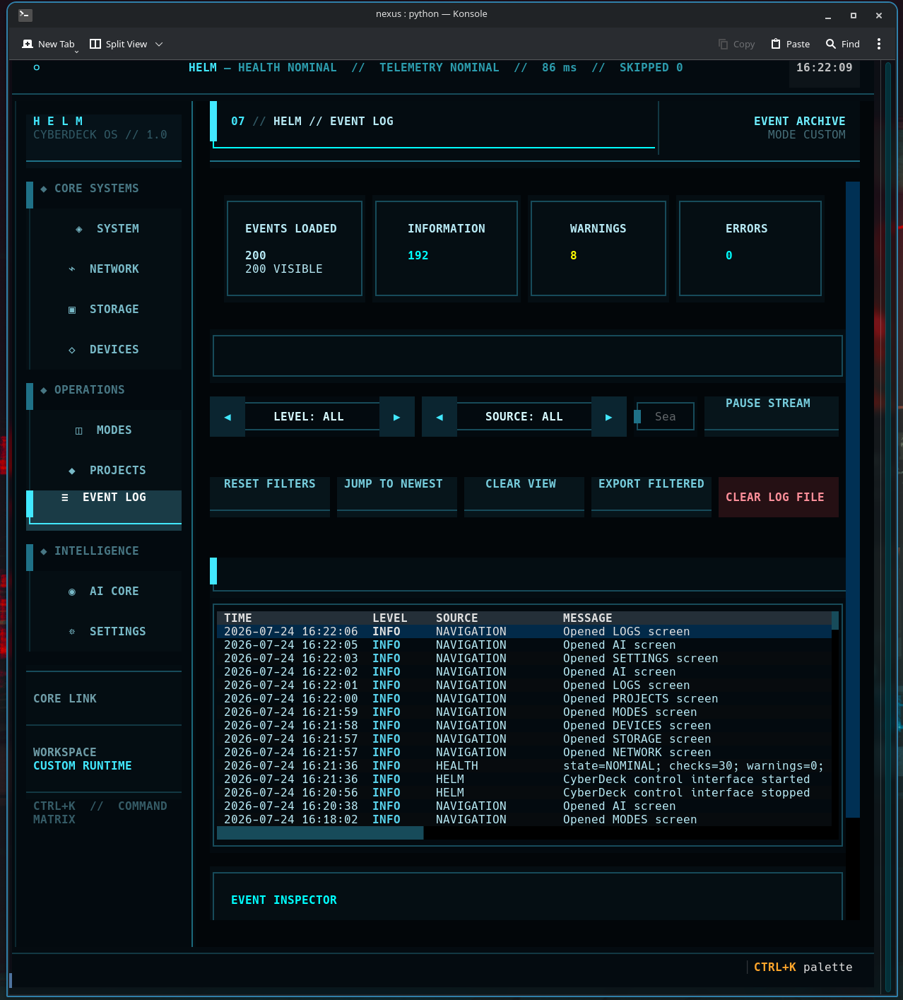
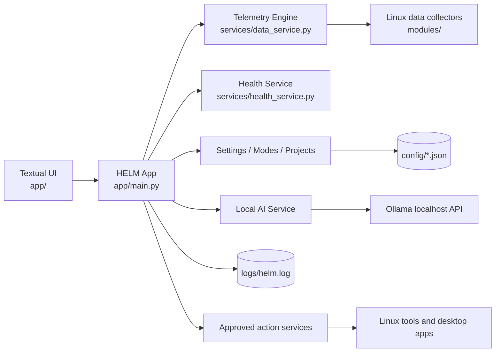

# ◈ HELM CyberDeck OS

<p align="center">
  <strong>A cyberpunk terminal control center for Arch Linux with live telemetry, diagnostics, local AI, serial tools, workspaces and project management.</strong>
</p>

<p align="center">
  
</p>

<p align="center">
  <a href="README.pl.md">Polska wersja</a> ·
  <a href="docs/INSTALLATION.md">Installation</a> ·
  <a href="docs/FEATURES.md">Features</a> ·
  <a href="docs/ARCHITECTURE.md">Architecture</a> ·
  <a href="AI_DISCLOSURE.md">AI disclosure</a>
</p>

## What is HELM?

**HELM CyberDeck OS** is a full-screen terminal user interface built with Python and Textual. It combines system monitoring, Linux diagnostics, device and UART tooling, project tracking, operational workspaces, persistent logs, a local Ollama assistant and a startup health scanner in one interface.

HELM was designed for an Arch Linux + KDE Plasma workstation and a maker/embedded workflow. It is not a Linux distribution and does not replace the host operating system; it is a local command and telemetry layer running inside a terminal.

## AI development disclosure

> The architecture, source code and documentation of HELM CyberDeck OS were generated iteratively with **ChatGPT by OpenAI**. Dariusz Kubicki defined the concept and requirements, tested every iteration on the target machine, integrated the Linux tools and hardware, reported failures, and approved the final design and behavior.

See [AI_DISCLOSURE.md](AI_DISCLOSURE.md) for the full statement.

## Highlights

- **Threaded telemetry engine** that keeps the Textual UI responsive and preserves the last valid snapshot when a data source fails.
- **Nine control-center screens:** SYSTEM, NETWORK, STORAGE, DEVICES, MODES, PROJECTS, LOGS, AI and SETTINGS.
- **Local AI via Ollama** with live read-only telemetry context, streaming output, session memory and uncertainty safeguards.
- **Core Health Service** with up to 30 startup checks covering telemetry, JSON configuration, tools, Ollama, Git, directories and the previous session.
- **Workspace automation** for maker, development, focus, command and chill profiles.
- **UART console** with device discovery, baud-rate control, RX/TX logs and serial connection management.
- **Persistent logs, backups and exports** with safe atomic JSON writes and rotation.
- **Cyberpunk visual identity** with an animated boot sequence, live health accents and responsive terminal panels.

## Screenshots

<table>
<tr>
<td width="50%"></td>
<td width="50%"></td>
</tr>
<tr>
<td align="center"><strong>Animated boot sequence</strong></td>
<td align="center"><strong>Hybrid local AI core</strong></td>
</tr>
<tr>
<td width="50%"></td>
<td width="50%"></td>
</tr>
<tr>
<td align="center"><strong>Workspace engine</strong></td>
<td align="center"><strong>Event archive and inspector</strong></td>
</tr>
</table>

## Quick start

HELM is primarily tested on Arch Linux. Python dependencies are pinned in `requirements.txt`.

```bash
git clone https://github.com/Dariusz-Kubicki/HELM-CyberDeck-OS.git
cd HELM-CyberDeck-OS

python -m venv venv
source venv/bin/activate
python -m pip install --upgrade pip
python -m pip install -r requirements.txt

python -m app.main
```

The helper launcher also detects an existing `venv`:

```bash
./scripts/run-helm.sh
```

For full system integration, Ollama setup and optional packages, read [docs/INSTALLATION.md](docs/INSTALLATION.md).

## Screen overview

| Screen | Purpose |
|---|---|
| **SYSTEM** | CPU, GPU, RAM, root storage, history graphs, per-core telemetry, top processes, alerts and approved diagnostic actions. |
| **NETWORK** | Active interface, IP, link speed, transfer rates, gateway/DNS tests, latency, packet loss, connections and listening sockets. |
| **STORAGE** | Disk usage, I/O history, device and partition inventory, NVMe temperature, SMART state and storage actions. |
| **DEVICES** | USB and serial discovery, permissions, VID/PID data, hot-plug timeline and a live UART console. |
| **MODES** | Editable operational workspaces, application manifests, power profiles, launch reports and mode activation. |
| **PROJECTS** | Project database, priority/progress/status editing, completed-project archive and folder/editor/GitHub actions. |
| **LOGS** | Persistent rotating event log, filtering, pause/resume, inspector, filtered export and guarded clearing. |
| **AI** | Deterministic diagnostics plus local Ollama chat with live read-only HELM context and streaming output. |
| **SETTINGS** | Runtime interval, startup screen, log capacity, AI configuration, backups, exports, restore and diagnostics. |

The detailed behavior of every screen and action is documented in [docs/FEATURES.md](docs/FEATURES.md).

## Architecture



Read [docs/ARCHITECTURE.md](docs/ARCHITECTURE.md) for worker flow, failure isolation, services and the complete source-file map.

## Requirements

### Core

- Linux; Arch Linux is the primary target.
- Python 3.11 or newer.
- Textual 8.2.8.
- psutil 7.2.2.
- pyserial 3.5.
- A terminal with 256-color support; around **122 × 57** cells is recommended for the intended layout.

### Optional integrations

HELM detects tools at runtime and degrades gracefully when optional programs are missing:

- `ollama` and a local model such as `qwen3:8b`
- `nvidia-smi`
- `smartctl`
- `btop`, `sensors`, `nmcli`, `ip`, `ss`, `ping`, `tracepath`/`traceroute`
- `lsusb`, `udevadm`, `lsblk`, `findmnt`
- Konsole, Kitty, Alacritty or xterm for detached diagnostics
- Dolphin or `xdg-open` for locations
- Arduino IDE, VS Code/VSCodium or Kate for workspace and project actions

## Command palette

Press **Ctrl+K** to open the global command matrix. It exposes:

- navigation to every HELM screen;
- activation of configured workspaces;
- full deterministic diagnostic;
- AI help;
- a fresh Core Health scan;
- display or export of the latest health report.

## Configuration

HELM stores human-readable JSON in `config/`:

- `settings.json` — runtime and local AI settings;
- `modes.json` — operational workspaces and application manifests;
- `projects.json` — project records;
- `mode_state.json` — generated runtime state and intentionally ignored by Git.

Backups and exports are created under ignored runtime directories. See [docs/CONFIGURATION.md](docs/CONFIGURATION.md).

## Safety model

- The local AI receives a **read-only snapshot** and is explicitly told not to claim it executed commands or changed the machine.
- AI telemetry gaps such as `N/A` or `SMART UNAVAILABLE` are not treated as evidence of hardware failure.
- Interactive system actions are allow-listed in dedicated services rather than generated by the model.
- Project GitHub URLs are restricted to HTTPS GitHub hosts.
- JSON updates use temporary files, `fsync` and atomic replacement.
- Destructive UI operations use confirmation steps.

More details: [SECURITY.md](SECURITY.md).

## Repository layout

```text
app/                 Textual widgets, screens, main application and TCSS
modules/             Read-only collectors for Linux and project data
services/            Telemetry, health, AI, persistence and action services
config/              Editable JSON configuration
scripts/             Launcher and standalone diagnostic script
docs/                Installation, architecture and feature documentation
logs/                 Runtime log directory; log data is ignored
requirements.txt     Pinned Python dependencies
```

## Development status

**Current release: v1.0.0**

The first release is feature-complete for the original CyberDeck workstation. Future work is tracked in [CHANGELOG.md](CHANGELOG.md) and may include automated tests, packaging, plugin APIs and alternate platform adapters.

## License

Released under the [MIT License](LICENSE).

## Acknowledgements

- [Textual](https://textual.textualize.io/) for the TUI framework.
- [psutil](https://psutil.readthedocs.io/) for system/process telemetry.
- [pySerial](https://pyserial.readthedocs.io/) for UART communication.
- [Ollama](https://ollama.com/) for local model execution.
- ChatGPT by OpenAI for iterative architecture, implementation and documentation generation.
