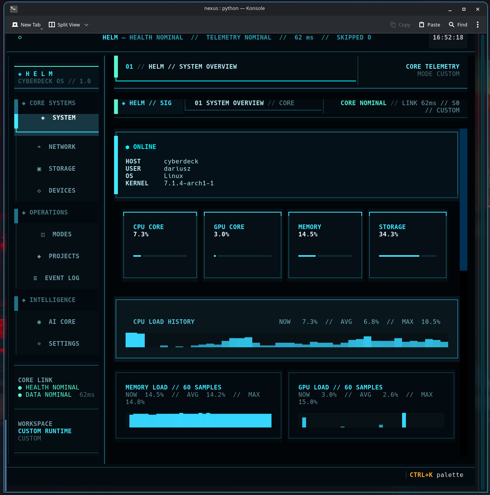

# ◈ HELM CyberDeck OS

<p align="center">
  <strong>Cyberpunkowe centrum sterowania dla Arch Linux: telemetria, diagnostyka, lokalne AI, UART, projekty i profile pracy.</strong>
</p>

<p align="center">
  
</p>

<p align="center">
  <a href="README.md">English version</a> ·
  <a href="docs/INSTALLATION.md">Instalacja</a> ·
  <a href="docs/FEATURES.md">Funkcje</a> ·
  <a href="docs/ARCHITECTURE.md">Architektura</a> ·
  <a href="AI_DISCLOSURE.md">Informacja o AI</a>
</p>

## Czym jest HELM?

**HELM CyberDeck OS** to pełnoekranowa aplikacja terminalowa napisana w Pythonie i frameworku Textual. Łączy monitoring komputera, diagnostykę Linuksa, narzędzia USB/UART, zarządzanie projektami, profile pracy, trwałe logi, lokalnego asystenta Ollama oraz automatyczny skaner kondycji systemu.

Projekt został zbudowany dla stanowiska Arch Linux + KDE Plasma używanego do elektroniki, embedded i programowania. HELM nie jest osobną dystrybucją ani zamiennikiem systemu operacyjnego — działa jako lokalna warstwa sterowania uruchamiana w terminalu.

## Jawna informacja o ChatGPT

> Architektura, kod źródłowy i dokumentacja HELM CyberDeck OS powstały iteracyjnie z użyciem **ChatGPT firmy OpenAI**. Dariusz Kubicki określił pomysł i wymagania, testował każdą iterację na docelowym komputerze, integrował narzędzia i sprzęt, zgłaszał błędy oraz zatwierdzał końcowe decyzje projektowe.

Pełna informacja znajduje się w [AI_DISCLOSURE.md](AI_DISCLOSURE.md).

## Najważniejsze elementy

- wielowątkowy silnik telemetrii, który nie blokuje interfejsu;
- dziewięć ekranów centrum sterowania;
- lokalne AI Ollama z kontekstem bieżącej telemetrii;
- do 30 testów kondycji wykonywanych podczas uruchamiania;
- edytowalne profile pracy i manifesty aplikacji;
- konsola UART z wykrywaniem urządzeń i historią zdarzeń;
- trwałe logi, kopie ustawień i eksporty;
- animowany ekran startowy oraz dynamiczny cyberpunkowy interfejs.

## Szybkie uruchomienie

```bash
git clone https://github.com/Dariusz-Kubicki/HELM-CyberDeck-OS.git
cd HELM-CyberDeck-OS

python -m venv venv
source venv/bin/activate
python -m pip install --upgrade pip
python -m pip install -r requirements.txt

python -m app.main
```

Można też użyć launchera:

```bash
./scripts/run-helm.sh
```

Pełna instrukcja wraz z Ollamą i pakietami systemowymi znajduje się w [docs/INSTALLATION.md](docs/INSTALLATION.md).

## Ekrany HELM

| Ekran | Funkcja |
|---|---|
| **SYSTEM** | CPU, GPU, RAM, dysk systemowy, wykresy, rdzenie CPU, procesy, alerty i diagnostyka. |
| **NETWORK** | Interfejs, IP, przepustowość, gateway, DNS, ping, utrata pakietów, połączenia i porty nasłuchujące. |
| **STORAGE** | Dyski, partycje, obciążenie I/O, temperatura NVMe, SMART i akcje diagnostyczne. |
| **DEVICES** | USB, porty szeregowe, uprawnienia, VID/PID, zdarzenia hot-plug i konsola UART. |
| **MODES** | Profile CHILL, MAKER, DEVELOPMENT, FOCUS i COMMAND oraz własne profile i aplikacje. |
| **PROJECTS** | Baza projektów, status, priorytet, postęp, archiwum ukończonych oraz akcje folder/editor/GitHub. |
| **LOGS** | Obracany log zdarzeń, filtry, pauza, inspektor, eksport i bezpieczne czyszczenie. |
| **AI** | Deterministyczna diagnostyka i lokalny model Ollama z transmisją odpowiedzi na żywo. |
| **SETTINGS** | Interwał telemetrii, ekran startowy, limity logów, AI, backupy, eksport i reset. |

Szczegółowe wyjaśnienie wszystkich kontrolek i modułów: [docs/FEATURES.md](docs/FEATURES.md).

## Bezpieczeństwo

- lokalne AI dostaje tylko kontekst do odczytu;
- model nie wykonuje samodzielnie poleceń systemowych;
- akcje systemowe znajdują się na jawnej liście w osobnych serwisach;
- brak danych telemetrycznych nie jest interpretowany jako awaria sprzętu;
- zmiany JSON są zapisywane atomowo;
- operacje destrukcyjne wymagają potwierdzenia.

Więcej: [SECURITY.md](SECURITY.md).

## Licencja

Projekt udostępniany jest na licencji [MIT](LICENSE).
