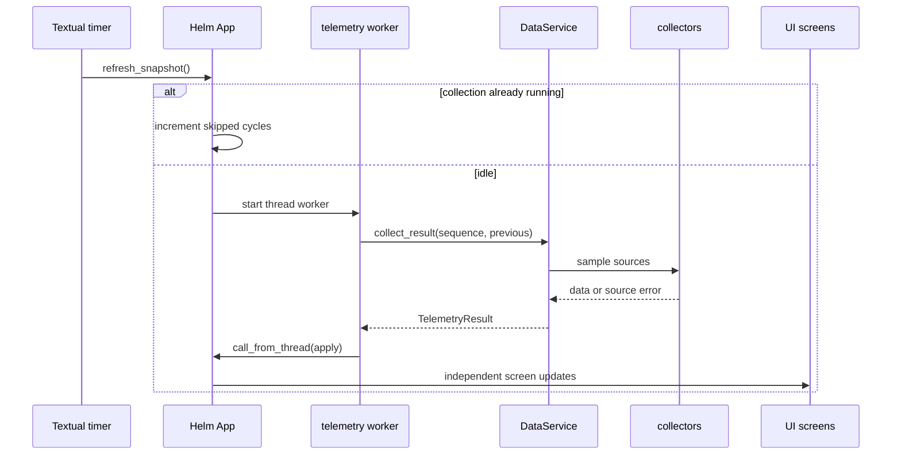

# Architecture

## Design goals

1. Keep Textual responsive.
2. Isolate optional Linux integrations.
3. Retain useful previous data when a collector fails.
4. Keep AI advisory and read-only.
5. Store editable state in transparent JSON.

## Runtime flow

## Failure isolation

`DataService.collect_result()` wraps each collector. An error records its source and fallback state; previous valid data is reused when possible. Required components without a fallback cause a failed snapshot. UI screen failures are also isolated. Logs are emitted when an issue appears, changes or recovers.

Only one telemetry job runs at a time, and late sequence results are ignored.

## Workers

Blocking tasks use Textual thread workers: telemetry, Core Health, Ollama streaming, network diagnostics and UART reading. Results return to the UI with `call_from_thread`; shutdown cancels active workers.

## Source map

### `app/`

| File | Role |
|---|---|
| `main.py` | Composition, navigation, workers, updates, command palette, modes, settings and health. |
| `theme.tcss` | CyberDeck visual system. |
| `sidebar.py` | Navigation and live state. |
| `signature_rail.py` | Module/core HUD. |
| `dashboard.py` | CPU/GPU/RAM/storage cards. |
| `cpu_history.py`, `resource_history.py` | History buffers and sparklines. |
| `system_panel.py`, `system_inspector.py`, `system_alerts.py`, `system_actions.py` | SYSTEM components. |
| `screens/boot.py` | Startup modal. |
| `screens/system.py` | SYSTEM coordinator. |
| `screens/network.py` | Network screen/diagnostics/actions. |
| `screens/storage.py` | Storage screen/history/actions. |
| `screens/devices.py` | USB/serial/UART screen. |
| `screens/modes.py` | Workspace editor. |
| `screens/projects.py` | Project editor. |
| `screens/logs.py` | Log filters/table/inspector. |
| `screens/ai.py` | Deterministic and local AI. |
| `screens/settings.py` | Runtime/AI settings and recovery. |

### `modules/`

| File | Role |
|---|---|
| `hardware.py` | CPU/RAM/disk/temperature helpers. |
| `gpu.py` | NVIDIA telemetry. |
| `system.py` | Host identity and uptime. |
| `network.py` | Interface and rate sample. |
| `network_diagnostics.py` | Gateway/DNS/ping/sockets. |
| `storage.py` | I/O, disks, partitions, temperatures and SMART. |
| `devices.py` | USB/serial enumeration and events. |
| `resources.py` | Cores, load, swap and processes. |
| `projects.py` | Project JSON sample. |

### `services/`

| File | Role |
|---|---|
| `data_service.py` | Fault-tolerant snapshot assembly. |
| `health_service.py` | Startup checks and report export. |
| `local_ai_service.py` | Ollama API client. |
| `assistant_service.py` | Deterministic diagnostics. |
| `log_service.py` | Persistent rotating logs. |
| `settings_service.py` | Validation, atomic save, backup/export. |
| `mode_service.py` | Workspace validation/mutation/state/power. |
| `workspace_service.py` | Application manifest launching. |
| `project_service.py` | Project mutation. |
| `*_action_service.py` | Allow-listed system side effects. |
| `alert_service.py` | Threshold alerts. |

## Data and persistence

`SystemSnapshot` is passed to all screens and AI context. JSON services validate data and write with temp-file, flush, `fsync` and atomic `os.replace`. Logs are pipe-delimited, locked and rotated. Runtime state and exports are ignored by Git.

## Action security

Display code does not construct arbitrary shell commands. Each action service maps known IDs to fixed commands or validated paths/URLs. AI output is not routed to these actions.

## Adding a collector

1. Add a sample dataclass and monitor in `modules/`.
2. Add collection and fallback logic to `DataService`.
3. Extend `SystemSnapshot` when global access is needed.
4. Update the relevant Textual widget/screen.
5. Add health checks and documentation when appropriate.
