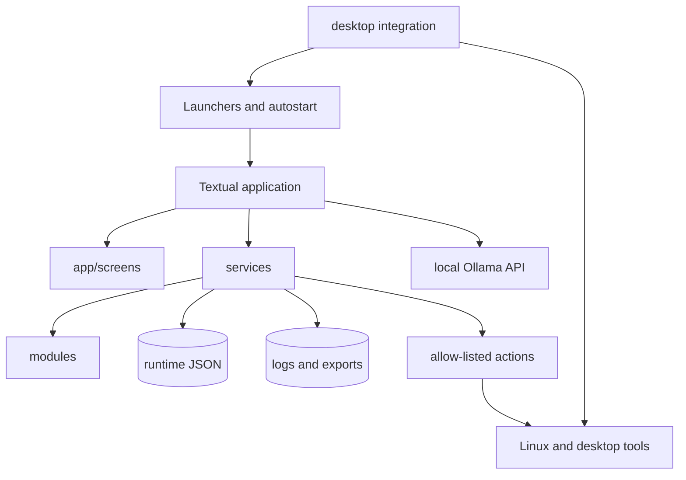

# Codebase Map

This map describes the HELM v1.2 codebase at the functional freeze commit
`1d4b9ce`. It is intended for maintainers, reviewers and future AI-assisted
work sessions.

## System layers



The important boundary is between **observation** and **side effects**:

- `modules/` gathers data and should remain read-only;
- `services/*_action_service.py` and `workspace_service.py` contain approved
  side effects;
- `app/` renders state, accepts user intent and delegates work;
- local AI output is advisory and is never executed as a shell command.

## Startup path

1. `helm`, `helm-start`, `helm-run` or `scripts/run-helm.sh` selects the project
   directory and Python environment.
2. `python -m app.main` constructs `Helm`.
3. `Helm.__init__()` creates telemetry, logging, settings, workspace, action and
   health services.
4. Runtime JSON is loaded or recovered before the first screen is shown.
5. The Textual composition creates the sidebar, signature rail and nine screens.
6. A timer starts one background telemetry collection at a time.
7. The first usable `SystemSnapshot` triggers the startup Core Health scan.
8. Results return to the UI through Textual thread-safe callbacks.

## `app/` — presentation and orchestration

| Path | Responsibility |
|---|---|
| `app/main.py` | Main Textual `Helm` application, composition, navigation, worker lifecycle, telemetry application, settings/mode actions, command palette and Core Health integration. |
| `app/theme.tcss` | Complete visual layout and cyberdeck theme. |
| `app/sidebar.py` | Navigation groups, version display and live state labels. |
| `app/signature_rail.py` | Current module, context, workspace and core-state HUD. |
| `app/dashboard.py` | Top-level CPU/GPU/RAM/storage metric cards. |
| `app/cpu_history.py` | Per-core history storage and rendering helpers. |
| `app/resource_history.py` | Bounded time-series history for shared resource graphs. |
| `app/system_panel.py` | Host and system summary panel. |
| `app/system_inspector.py` | CPU cores, load, swap and process inspection. |
| `app/system_alerts.py` | Visual alert list. |
| `app/system_actions.py` | SYSTEM action buttons and result display. |
| `app/screens/boot.py` | Skippable startup modal. |
| `app/screens/system.py` | SYSTEM screen coordinator. |
| `app/screens/network.py` | Network telemetry, diagnostics and actions. |
| `app/screens/storage.py` | Storage telemetry, SMART state and actions. |
| `app/screens/devices.py` | USB/serial inventory, hot-plug events and UART console. |
| `app/screens/modes.py` | Workspace editor, application manifest and activation flow. |
| `app/screens/projects.py` | Project database editor and project actions. |
| `app/screens/logs.py` | Filtering, inspection, export and guarded clearing. |
| `app/screens/ai.py` | Deterministic assistant and streaming local Ollama session. |
| `app/screens/settings.py` | Runtime settings, backups, exports, reset and diagnostics. |

`app/main.py` is intentionally the integration point, but it is also the
largest file. New data collection should not be implemented there; put it in a
collector or service and keep `main.py` focused on coordination.

## `modules/` — read-only data collection

| Path | Responsibility |
|---|---|
| `modules/hardware.py` | CPU, RAM, root disk and CPU-temperature helpers. |
| `modules/gpu.py` | NVIDIA telemetry through `nvidia-smi`. |
| `modules/system.py` | Host identity, user, OS, kernel and uptime. |
| `modules/network.py` | Active interface and transfer-rate samples. |
| `modules/network_diagnostics.py` | Gateway, DNS, ping, packet loss, connections and sockets. |
| `modules/storage.py` | Block devices, partitions, I/O, NVMe temperature and SMART cache. |
| `modules/devices.py` | USB/serial enumeration and hot-plug event history. |
| `modules/resources.py` | Load, swap, core frequencies and top processes. |
| `modules/projects.py` | Cached read-side monitor for the runtime project database. |

Collectors must tolerate missing optional tools and return explicit unavailable
states instead of turning absent telemetry into a hardware-failure claim.

## `services/` — application logic and side effects

| Path | Responsibility |
|---|---|
| `services/data_service.py` | Builds the fault-tolerant `SystemSnapshot`, records source issues and reuses previous valid data. |
| `services/runtime_data.py` | Resolves the XDG data root and provides validated, atomic, recoverable JSON storage. |
| `services/settings_service.py` | Settings validation, runtime persistence, settings-only backups and profile exports. |
| `services/mode_service.py` | Workspace definitions, active state, validation, mutation and power-profile handling. |
| `services/project_service.py` | Project create/update/delete validation and persistence. |
| `services/workspace_service.py` | Launches browser/native application manifests and notifications. |
| `services/log_service.py` | Thread-safe pipe-delimited logs, rotation and export support. |
| `services/health_service.py` | Startup Core Health checks and Markdown report export. |
| `services/assistant_service.py` | Deterministic, read-only diagnostic answers. |
| `services/local_ai_service.py` | Local Ollama status and streaming `/api/chat` client. |
| `services/alert_service.py` | Threshold-based system alert generation. |
| `services/system_action_service.py` | Fixed SYSTEM diagnostic commands. |
| `services/network_action_service.py` | Fixed network commands in a supported terminal. |
| `services/storage_action_service.py` | Fixed SMART/storage commands and validated mount opening. |
| `services/device_action_service.py` | Arduino/udev/serial diagnostics. |
| `services/project_action_service.py` | Validated project folders, terminals, editors and GitHub URLs. |

## Runtime and repository data

Repository configuration now contains **templates only**:

```text
config/
├── settings.example.json
├── modes.example.json
├── mode_state.example.json
└── projects.example.json
```

Mutable data lives outside Git. The default tree is:

```text
~/.local/share/helm/
├── settings.json
├── modes.json
├── mode_state.json
├── projects.json
├── backups/
├── exports/
└── recovery/
    ├── settings.last-good.json
    ├── modes.last-good.json
    ├── mode_state.last-good.json
    ├── projects.last-good.json
    └── *-TIMESTAMP.broken.json
```

See [RUNTIME_DATA.md](RUNTIME_DATA.md) for resolution, migration and recovery.

## Desktop integration

| Path | Responsibility |
|---|---|
| `desktop/launchers/` | `helm` command, startup bridges, Desktop Node and Data Vault launchers. |
| `desktop/autostart/` | Plasma session autostart entries. |
| `desktop/config/` | Desktop Node storage-volume example. |
| `desktop/conky/` | Desktop Node HUD configuration. |
| `desktop/plasma/` | HELM color scheme, Plasma style, layout and lock-screen overlay. |
| `desktop/sddm/` | HELM Access Gate. |
| `desktop/plymouth/` | HELM Early Boot. |
| `desktop/boot/` | Silent and diagnostic systemd-boot templates. |
| `desktop/apps/` | Firefox, Arduino, Dolphin, Konsole and related snapshots. |
| `desktop/manifests/` | Captured package and desktop-version state. |
| `scripts/desktop/` | Install, doctor, backup, restore and lock-screen rebuild tooling. |

## Tests and checks

| Path | Coverage |
|---|---|
| `tests/test_runtime_data.py` | Default creation, legacy migration, example fallback, quarantine and last-good updates. |
| `tests/test_runtime_services.py` | Settings and project migration/recovery, including ProjectMonitor. |
| `tests/test_mode_service_runtime.py` | Workspace database and active-state migration/recovery. |
| `scripts/check-release.sh` | Compilation, unit tests, example JSON validation, runtime-artifact hygiene and common secret scan. |
| `scripts/desktop/doctor.sh` | Installed CyberDeck state, runtime JSON, recovery snapshots and desktop integration. |
| `.github/workflows/python-checks.yml` | Runs the release check on pushes and pull requests. |

## Change-impact guide

- **New telemetry value:** collector → `SystemSnapshot` → fallback policy → screen
  → AI context/health check if relevant → tests/docs.
- **New editable runtime entity:** example JSON → validator/service using
  `RuntimeJsonStore` → UI → migration/recovery tests → doctor check → docs.
- **New side effect:** dedicated allow-listed service → confirmation/error handling
  in UI → logging → security review.
- **New desktop component:** source snapshot → installer → doctor → backup/restore
  → recovery docs.
- **Release-only change:** update changelog/release notes/screenshots/version; do not
  mix unrelated refactors into the release commit.
